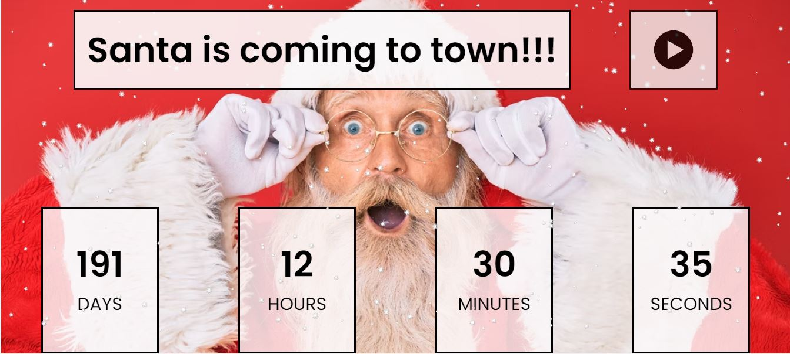

  <h1>New Year Countdown</h1> 
  

<!-- ABOUT THE PROJECT -->
## About The Project

  

    <a href="https://santa-app.glitch.me/">View Demo Here</a>
  

## Built With

[HTML5](https://www.w3schools.com/html/) / [CSS3](https://www.w3schools.com/css/) / [JavaScript](https://www.w3schools.com/js/)
 
<!-- USAGE EXAMPLES -->
## Usage

Project Link: https://github.com/kateFrontend/New-Year-Countdown

